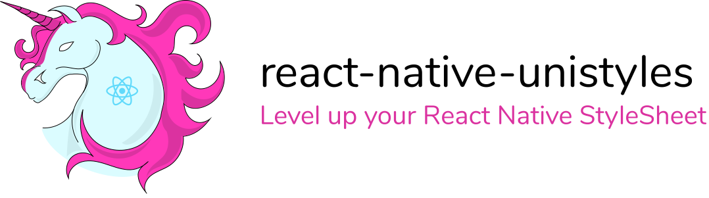

[](https://codemask.com)


<picture>
 <source media="(prefers-color-scheme: dark)" srcset="assets/uni-dark.svg">
 
</picture>

## Features
- ⚡ Blazing fast, adds around ~3ms on top of StyleSheet*
- 🎳 Share up to 100% of your styles across platforms in monorepo
- 🎯 Doesn't introduce new components
- 🖥️ Supports custom breakpoints and css-like media queries
- 🎨 Access theme in your StyleSheets and components
- 🪄 Supports dynamic functions to access values from JSX
- 🥳 Compatible with Expo, Expo Go, Bare React Native and React Native Web
- ⚔️ No 3rd party dependencies

*-based on this [benchmark](https://github.com/efstathiosntonas/react-native-style-libraries-benchmark)

## Installation

```cmd
yarn add react-native-unistyles
```

## [Documentation](https://unistyles-docs.vercel.app/)
- [Start here](https://unistyles-docs.vercel.app/start/setup/)
- [References](https://unistyles-docs.vercel.app/reference/create-style-sheet/)
- [Examples](https://unistyles-docs.vercel.app/example/breakpoints/)

## Blog post

Read about what drove me to create this library in this blog post [here](https://www.reactnativecrossroads.com/posts/level-up-react-native-styles).

## Sponsor my work

If you found the `react-native-unistyles` time-saving and valuable, please consider sponsoring my work. Your support enables me to continue creating libraries with a fresh approach.

Github: https://github.com/sponsors/jpudysz

Ko-fi: https://ko-fi.com/jpudysz

Your support is greatly appreciated and helps me dedicate more time and resources to creating quality libraries. Thank you for all the support!

## License

MIT
